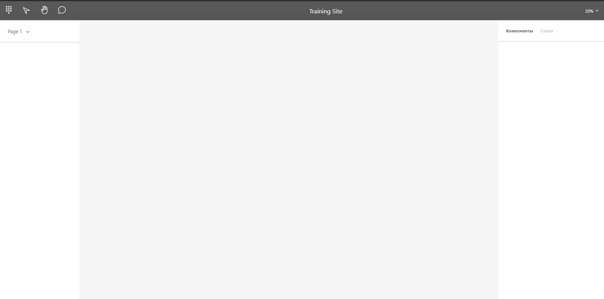

# Визуальный сайт конструктор

## Для запуск проекта
### `yarn start`

Проект открывется в режиме разработки на http://localhost:3000

### `Демо проекта. Первый набросок был таким` http://skrinshoter.ru/v/200821/Na9p7vBH?a

## Основная идея

1. Облегчить рутинный труд HTML-верстальщикам. 
2. Дать возможность верстать неопытным или незнающим тонкостей верстки людям и получать валидную верстку.
3. Сделать этот проект как opensource, для привлечения идей и помощи от других людей.

## Какова конечная цель проекта.

1. Возможность загрузки изображения и самой верстке компонентов с более высокой скоростью.
2. Гибкая настройка UI компонентов, с внесением изменений в сами стили в правой панели. И заданием классов, id, дата-атрибутов
3. Более удобный pixel-perfect.
4. Генерация проекта в html+css, с индивидуальными настроками. Минификация, либо какой-то bundle. Кроссбраузерность.
5. Возможность экспорта блоками.
6. Возможность экспорта верстки под шаблонизаторы (pug, handlebars и пр.)
7. Адаптив. Продумать это на все случаи жизни просто невозможно. Но управление блоками настроить можно.
8. Четкая, понятная, красивая документация.
9. Написать хорошие туториалы по работе с конструктором.

Дополнения: 
1. Интерация с figma.
2. БЭМ-анализатор и w3c-анализатор.
3. Самое трудное: Возможность экспорта верстки как компоненты для React, Vue, Angular и Svelte.

## Используемые технологии.
(Этот список будет дополняться)
1. React
2. Typescript
3. Styled-Components
4. react-icons
5. Eslint
6. Nodejs
7. GraphQL

=======
### `Скрин проекта. Ниже черновик. Первый набросок` http://skrinshoter.ru/v/200821/Na9p7vBH?a

